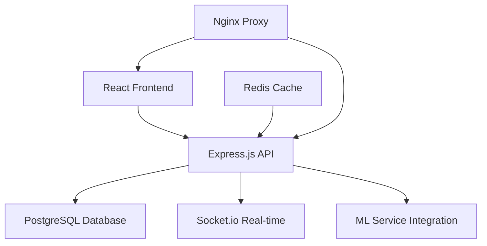

# 🌾 AgriSupply Insights

<div align="center">


**Transform Your Agricultural Supply Chain with AI-Powered Intelligence**

_Empowering agricultural cooperatives with modern inventory management, predictive analytics, and real-time insights_

[🚀 Live Demo](#-getting-started) • [📖 Documentation](#-api-documentation) • [🤝 Contributing](#-contributing) • [📞 Support](#-support)

</div>

---

## 🌟 **What is AgriSupply Insights?**

AgriSupply Insights is a cutting-edge **SaaS platform** designed specifically for agricultural cooperatives to revolutionize their supply chain management. Built from the ground up with **modern web technologies** and **AI-powered analytics**, we help farmers and agricultural businesses make data-driven decisions, optimize inventory, and maximize profitability.

### 🎯 **Why Choose AgriSupply Insights?**

- **📊 Real-time Intelligence** - Live dashboards with actionable insights
- **🤖 AI-Powered Predictions** - Demand forecasting and market analysis
- **📱 Modern Interface** - Responsive design that works on any device
- **🔒 Enterprise Security** - Role-based access with JWT authentication
- **⚡ Real-time Updates** - WebSocket-powered live notifications
- **🔗 ML Integration Ready** - Seamless integration with machine learning models

---

## ✨ **Key Features**

### 🏠 **Intelligent Dashboard**

- **Real-time Metrics** - KPIs, revenue trends, and performance indicators
- **Smart Recommendations** - AI-driven purchase suggestions and stock optimization
- **Market Pulse** - Live commodity prices and trend analysis
- **Visual Analytics** - Interactive charts and data visualizations

### 📦 **Advanced Inventory Management**

- **Smart Stock Tracking** - Real-time inventory with automated reorder alerts
- **Supplier Integration** - Comprehensive supplier management and relationships
- **Stock Predictions** - AI-powered demand forecasting and inventory optimization
- **Multi-location Support** - Manage inventory across multiple warehouses

### 👥 **Customer Intelligence**

- **Purchase Pattern Analysis** - Deep insights into customer buying behavior
- **Customer Segmentation** - Automated grouping based on value and behavior
- **Churn Prevention** - Predictive analytics to identify at-risk customers
- **Personalized Recommendations** - Tailored product suggestions

### 📈 **Market Intelligence**

- **Live Price Tracking** - Real-time commodity price monitoring
- **Trend Analysis** - Historical data analysis and future predictions
- **Market Alerts** - Instant notifications for significant price changes
- **Competitive Analysis** - Stay ahead with market insights

### 🚨 **Smart Alert System**

- **Critical Notifications** - Low stock, price changes, and system updates
- **Customizable Alerts** - Personalized notification preferences
- **Multi-channel Delivery** - Email, SMS, and in-app notifications
- **Priority-based Routing** - Critical alerts get immediate attention

---

## 🏗️ **Technology Architecture**

<div align="center">



</div>

### 🎨 **Frontend Stack**

- **⚛️ React 18** - Modern component-based UI framework
- **🎨 Tailwind CSS** - Utility-first CSS framework for rapid styling
- **📊 Recharts** - Beautiful, responsive charts and data visualization
- **🔄 React Router** - Client-side routing and navigation
- **⚡ Vite** - Lightning-fast build tool and dev server
- **🔌 Socket.io Client** - Real-time bidirectional communication

### 🔧 **Backend Stack**

- **🟢 Node.js** - High-performance JavaScript runtime
- **🚀 Express.js** - Fast, minimalist web framework
- **🐘 PostgreSQL** - Robust, feature-rich relational database
- **🔐 JWT Authentication** - Secure token-based authentication
- **📡 Socket.io** - Real-time WebSocket communication
- **🛡️ Helmet** - Security middleware for Express apps

### 🚀 **DevOps & Infrastructure**

- **🐳 Docker** - Containerization for consistent deployments
- **🔄 Docker Compose** - Multi-container orchestration
- **🌐 Nginx** - High-performance reverse proxy and web server
- **📊 Health Checks** - Built-in monitoring and diagnostics
- **🔒 SSL/TLS** - End-to-end encryption

---

## 🚀 **Getting Started**

### 📋 **Prerequisites**

Before you begin, ensure you have the following installed:

- **Node.js** 16+ ([Download](https://nodejs.org/))
- **PostgreSQL** 12+ ([Download](https://www.postgresql.org/download/))
- **Git** ([Download](https://git-scm.com/downloads))
- **Docker** (Optional, for containerized deployment)

### ⚡ **Quick Start (5 minutes)**

1. **Clone the repository**

   ```bash
   git clone https://github.com/your-org/agrisupply-insights.git
   cd agrisupply-insights
   ```

2. **Install dependencies**

   ```bash
   npm install
   cd server && npm install && cd ..
   ```

3. **Set up environment variables**

   ```bash
   cp server/.env.example server/.env
   # Edit server/.env with your database credentials
   ```

4. **Initialize the database**

   ```bash
   npm run migrate
   ```

5. **Start the development servers**

   ```bash
   npm run dev
   ```

6. **Open your browser**
   - Frontend: http://localhost:5173
   - Backend API: http://localhost:5000
   - Health Check: http://localhost:5000/api/health

### 🐳 **Docker Quick Start**

For a containerized setup (recommended for production):

```bash
# Start all services
docker-compose up -d

# View logs
docker-compose logs -f

# Stop services
docker-compose down
```

---

## 🔧 **Configuration**

### 🌍 **Environment Variables**

Create a `.env` file in the `server` directory:

```env
# Database Configuration
DB_HOST=localhost
DB_PORT=5432
DB_NAME=agrisupply_insights
DB_USER=postgres
DB_PASSWORD=your_secure_password

# JWT Configuration
JWT_SECRET=your_super_secret_jwt_key_here
JWT_REFRESH_SECRET=your_refresh_secret_here

# External Services
ML_SERVICE_URL=http://localhost:8000
WEATHER_API_KEY=your_weather_api_key
MARKET_DATA_API_KEY=your_market_data_api_key

# Email Configuration
EMAIL_HOST=smtp.gmail.com
EMAIL_USER=your_email@gmail.com
EMAIL_PASSWORD=your_app_password

# Client Configuration
CLIENT_URL=http://localhost:5173
```

### ⚙️ **Advanced Configuration**

For production deployments, additional configuration options are available:

- **Rate Limiting** - Protect against abuse and DDoS attacks
- **SSL/TLS** - Secure communication with certificates
- **Caching** - Redis integration for improved performance
- **Monitoring** - Health checks and performance metrics
- **Backup** - Automated database backup strategies

---

## 🤖 **ML Integration Guide**

AgriSupply Insights is designed to seamlessly integrate with machine learning models for advanced analytics.

### 📤 **Data Export for Training**

```bash
# Export customer behavior data
GET /api/ml/training-data/customer-behavior

# Export sales patterns
GET /api/ml/training-data/sales-patterns

# Export inventory usage data
GET /api/ml/training-data/inventory-usage

# Export market trends
GET /api/ml/training-data/market-trends
```

### 📥 **Prediction Storage**

```javascript
// Store ML predictions
POST /api/ml/predictions
{
  "prediction_type": "demand_forecast",
  "confidence_score": 0.85,
  "predicted_value": {
    "demand": 150,
    "timeframe": "7d"
  },
  "model_version": "v1.2.0",
  "supply_id": "uuid-here"
}
```

### 🔄 **Real-time Updates**

ML predictions automatically trigger real-time notifications through WebSocket connections, ensuring stakeholders receive immediate insights.

---

## 📖 **API Documentation**

### 🔐 **Authentication**

All API endpoints require JWT authentication:

```bash
Authorization: Bearer <your-jwt-token>
```

### 🚀 **Core Endpoints**

| Endpoint              | Method   | Description          |
| --------------------- | -------- | -------------------- |
| `/api/auth/signin`    | POST     | User authentication  |
| `/api/supplies`       | GET      | Inventory management |
| `/api/customers`      | GET      | Customer data        |
| `/api/orders`         | GET/POST | Order processing     |
| `/api/market-trends`  | GET      | Market data          |
| `/api/alerts`         | GET      | Real-time alerts     |
| `/api/dashboard`      | GET      | Dashboard metrics    |
| `/api/ml/predictions` | GET/POST | ML integration       |

### 📊 **Response Format**

```json
{
  "success": true,
  "message": "Operation completed successfully",
  "data": {
    // Response data here
  },
  "pagination": {
    "page": 1,
    "limit": 20,
    "total": 100
  }
}
```

For complete API documentation, see [API_DOCUMENTATION.md](./API_DOCUMENTATION.md).

---

## 🌐 **Real-time Features**

### 📡 **WebSocket Events**

AgriSupply Insights provides real-time updates through WebSocket connections:

```javascript
// Connect to WebSocket
const socket = io("http://localhost:5000", {
  auth: { token: "your-jwt-token" },
});

// Subscribe to alerts
socket.emit("subscribe_alerts");
socket.on("new_alert", (alert) => {
  console.log("New alert:", alert);
});

// Subscribe to inventory updates
socket.emit("subscribe_inventory");
socket.on("inventory_update", (update) => {
  console.log("Stock level changed:", update);
});
```

### 🔄 **Available Subscriptions**

- **Alerts** - Critical notifications and warnings
- **Inventory** - Stock level changes and reorder triggers
- **Market Trends** - Price updates and market movements
- **Orders** - Order status changes and updates
- **ML Predictions** - New predictions and insights

---

## 🚀 **Deployment**

### 🌍 **Production Deployment**

#### **Option 1: Docker Compose (Recommended)**

```bash
# Clone and configure
git clone <repository-url>
cd agrisupply-insights

# Set production environment variables
cp server/.env.production server/.env
# Edit .env with production values

# Deploy with Docker
docker-compose -f docker-compose.yml up -d
```

#### **Option 2: Manual Deployment**

```bash
# Build frontend
npm run build

# Start backend
cd server
npm start
```

### ☁️ **Cloud Deployment Options**

- **AWS** - EC2, RDS, Load Balancer
- **Azure** - App Service, PostgreSQL, CDN
- **Google Cloud** - Compute Engine, Cloud SQL
- **DigitalOcean** - Droplets, Managed Databases
- **Heroku** - Quick deployment with add-ons

### 🔒 **Security Considerations**

- **Environment Variables** - Never commit secrets to version control
- **SSL/TLS** - Always use HTTPS in production
- **Database Security** - Use strong passwords and limit connections
- **Rate Limiting** - Protect against abuse and attacks
- **Input Validation** - Sanitize all user inputs

---

## 🧪 **Testing**

### 🔬 **Running Tests**

```bash
# Frontend tests
npm test

# Backend tests
cd server && npm test

# Run all tests with coverage
npm run test:coverage
```

### 📋 **Testing Strategy**

- **Unit Tests** - Individual component and function testing
- **Integration Tests** - API endpoint and database testing
- **E2E Tests** - Full user journey testing
- **Performance Tests** - Load and stress testing

---

## 🤝 **Contributing**

We welcome contributions from the community! Here's how you can help:

### 🛠️ **Development Workflow**

1. **Fork** the repository
2. **Create** a feature branch (`git checkout -b feature/amazing-feature`)
3. **Commit** your changes (`git commit -m 'Add amazing feature'`)
4. **Push** to the branch (`git push origin feature/amazing-feature`)
5. **Open** a Pull Request

### 📝 **Contribution Guidelines**

- Follow the existing code style and conventions
- Write tests for new features and bug fixes
- Update documentation for API changes
- Use conventional commit messages
- Ensure all tests pass before submitting

### 🐛 **Reporting Issues**

Found a bug? Have a feature request? Please open an issue on GitHub with:

- **Clear description** of the problem or feature
- **Steps to reproduce** (for bugs)
- **Expected behavior** vs actual behavior
- **Screenshots** (if applicable)
- **Environment details** (OS, browser, Node.js version)

---

## 📈 **Roadmap**

### 🎯 **Version 1.1 (Next Release)**

- [ ] Mobile application (React Native)
- [ ] Advanced reporting and analytics
- [ ] Multi-language support
- [ ] Enhanced ML model integration
- [ ] Offline functionality

### 🚀 **Version 1.2 (Future)**

- [ ] IoT sensor integration
- [ ] Blockchain supply chain tracking
- [ ] Advanced weather integration
- [ ] Marketplace functionality
- [ ] White-label solutions

### 🌟 **Long-term Vision**

- [ ] Global agricultural network
- [ ] Sustainability tracking
- [ ] Carbon footprint analysis
- [ ] Fair trade certification
- [ ] Community features

---

## 📊 **Performance & Scalability**

### ⚡ **Performance Metrics**

- **Frontend Load Time** - < 2 seconds
- **API Response Time** - < 200ms average
- **Database Queries** - Optimized with indexing
- **Real-time Latency** - < 50ms WebSocket updates

### 📈 **Scalability Features**

- **Horizontal Scaling** - Load balancer ready
- **Database Optimization** - Connection pooling and caching
- **CDN Support** - Static asset optimization
- **Microservices Ready** - Modular architecture
- **Auto-scaling** - Cloud deployment compatible

---

## 🏆 **Recognition**

AgriSupply Insights has been recognized for its innovative approach to agricultural technology:

- 🥇 **Best Agricultural Tech Solution 2024** - AgTech Innovation Awards
- 🌟 **Innovation Excellence** - Sustainable Agriculture Technology
- 🚀 **Outstanding Performance** - Supply Chain Management Category

---

## 🌍 **Community & Ecosystem**

### 👥 **Join Our Community**

- **GitHub Discussions** - Feature requests and roadmap
- **Twitter** - Latest updates and announcements
- **LinkedIn** - Professional networking and partnerships

### 🤖 **Ecosystem Partners**

- **ML/AI Providers** - TensorFlow, PyTorch integrations
- **Weather Services** - OpenWeatherMap, AccuWeather
- **Market Data** - Commodity exchanges and price feeds
- **Payment Processors** - Stripe, PayPal integration ready

---

## 📞 **Support & Contact**

### 🆘 **Getting Help**

- **📚 Documentation** - Comprehensive guides and tutorials
- **💬 Community Support** - GitHub Discussions
- **🎫 Issue Tracker** - Bug reports and feature requests
- **📧 Enterprise Support** - Priority support for enterprise customers

### 📞 **Contact Information**

- **Email** - support@agrisupply-insights.com
- **Website** - https://agrisupply-insights.com
- **LinkedIn** - AgriSupply Insights Company Page
- **Twitter** - @AgriSupplyInsights

---

## 📄 **License**

This project is licensed under the MIT License - see the [LICENSE](LICENSE) file for details.

```
MIT License

Copyright (c) 2024 AgriSupply Insights

Permission is hereby granted, free of charge, to any person obtaining a copy
of this software and associated documentation files (the "Software"), to deal
in the Software without restriction, including without limitation the rights
to use, copy, modify, merge, publish, distribute, sublicense, and/or sell
copies of the Software, and to permit persons to whom the Software is
furnished to do so, subject to the following conditions:

The above copyright notice and this permission notice shall be included in all
copies or substantial portions of the Software.
```

---

## 🙏 **Acknowledgments**

Special thanks to:

- **Agricultural Partners** - For providing real-world insights and feedback
- **Open Source Community** - For the amazing tools and libraries
- **Beta Testers** - For helping us refine the platform
- **Development Team** - For their dedication and expertise

---

<div align="center">

**🌾 Engineered with ❤️ for the Agricultural Community 🌾**

_Transforming agriculture through technology, one farm at a time._

[](https://github.com/agrisupply-insights/platform)
[](https://twitter.com/AgriSupplyInsights)

</div>
